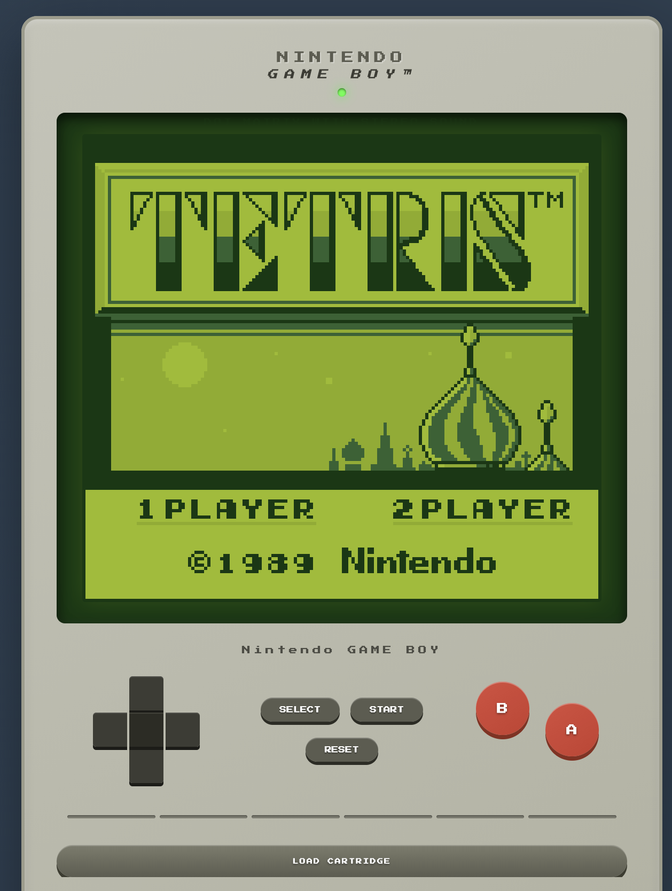

# RGB - Game Boy Emulator

A Game Boy emulator written in Rust, based on my original [GameBoyCPP](https://github.com/dimiro1/GameBoyCPP) implementation.

The main goal is to get familiar with Rust and WebAssembly. The frontend will be WebAssembly only.

## Status

This is a work in progress. I have no idea if I'm going to finish it.

## Screenshots




## AI disclaimer

I designed the entire system myself based on my previous [GameBoyCPP](https://github.com/dimiro1/GameBoyCPP) emulator. I used Claude Code to speed up the Rust implementation and navigate language idioms.

## Running

### CLI
```bash
cargo run -p rgb-cli
```

### WebAssembly
```bash
# Install wasm-pack
cargo install wasm-pack

# Build and run
cd rgb-wasm
wasm-pack build --target web
python3 -m http.server 8000
# Open http://localhost:8000
```
